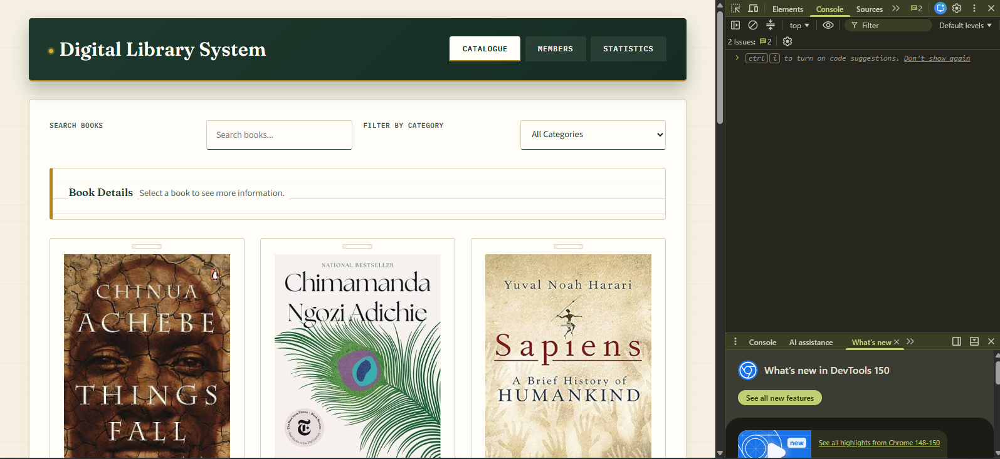
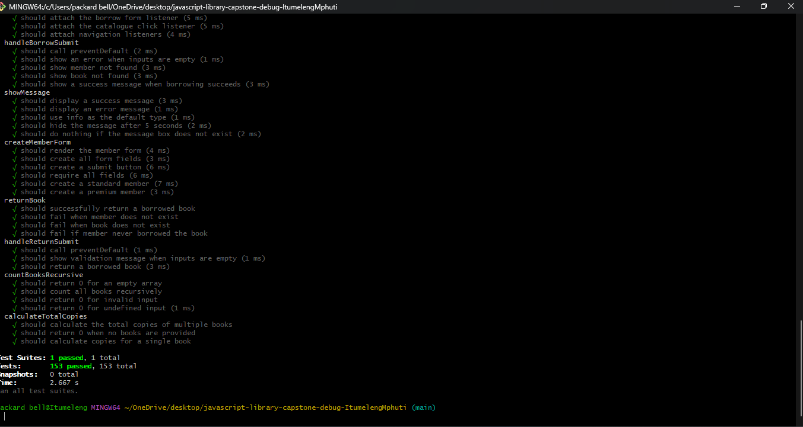
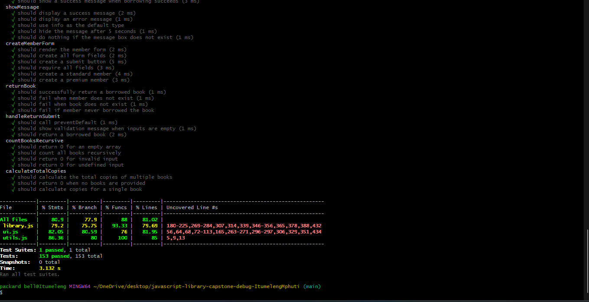
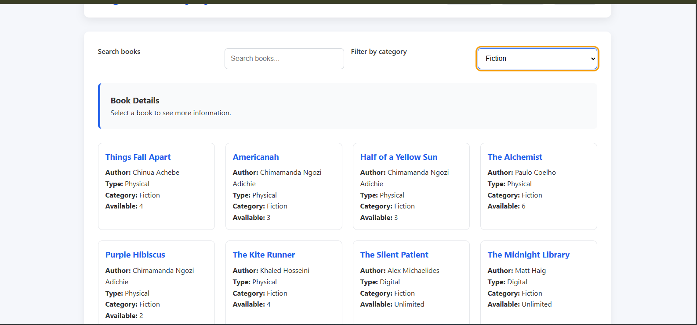
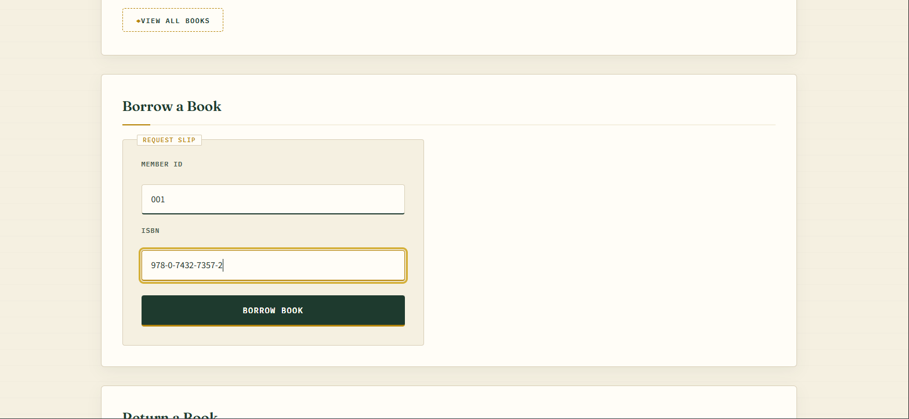
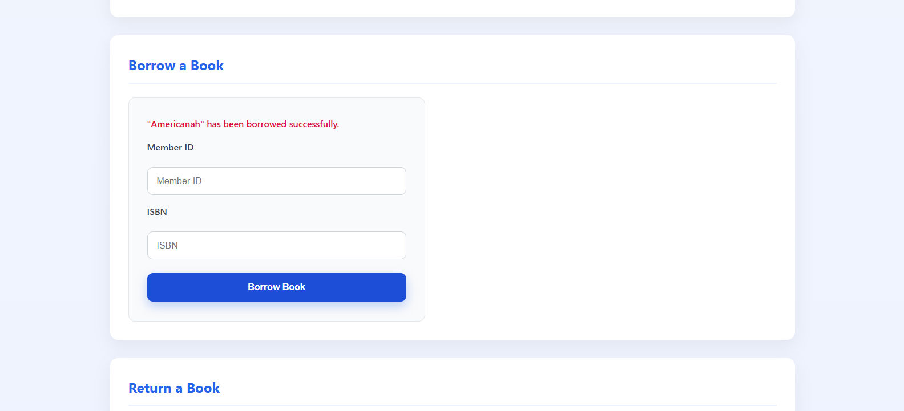
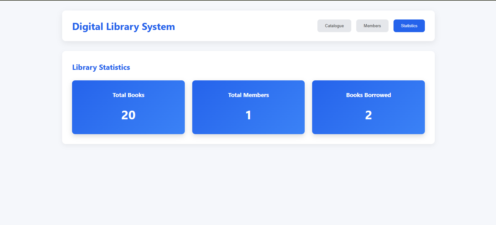
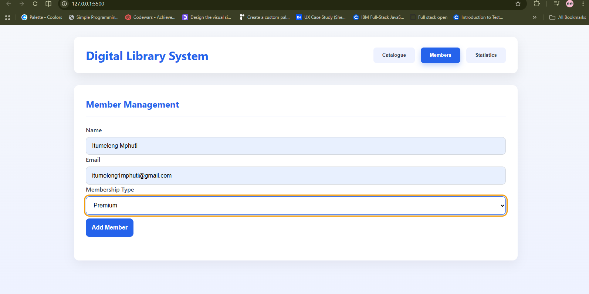
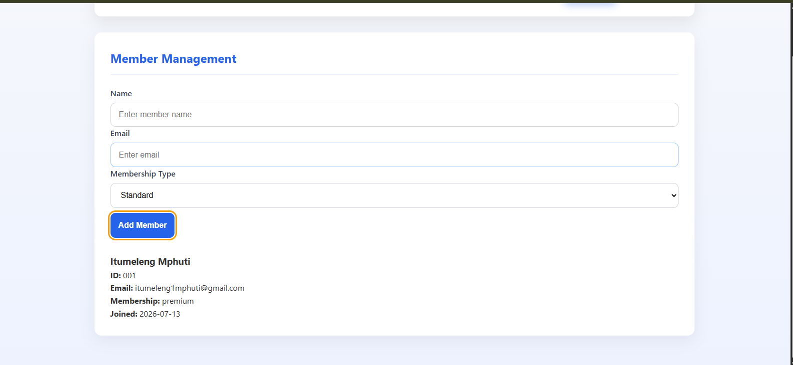
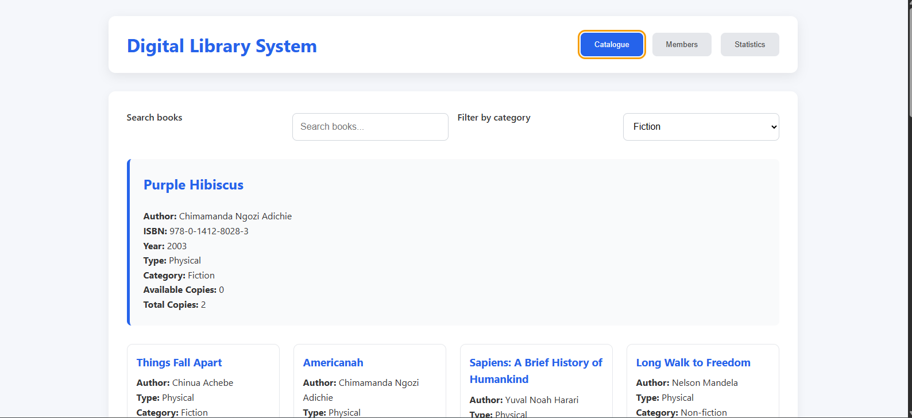

# JavaScript Library Management System

**Author:** Itumeleng Mphuti
**Project:** `javascript-library-capstone-debug-ItumelengMphuti`

---

## System Overview

The JavaScript Library Management System is a browser-based application that simulates the operations of a digital library. It allows librarians to manage books, members, borrowing, reservations, statistics, and data persistence using modern JavaScript (ES6+). The project follows an object-oriented design and demonstrates inheritance, modular programming, DOM manipulation, JSON data handling, Local Storage, and comprehensive unit testing with Jest.

The application supports both **physical books** and **digital books**, member management with different membership types, book searching and filtering, borrowing and reservation functionality, statistics tracking, and data import/export.

---

## Critical Errors Found

The following bugs were identified and corrected during development.

| #   | File       | Error                                                                                                                         | Severity |
| --- | ---------- | ----------------------------------------------------------------------------------------------------------------------------- | -------- |
| 1   | ui.js      | `initializeUI()` called as a bare function call before the DOM has finished parsing, every `querySelector` returns null      | High     |
| 2   | ui.js      | No null checks after any DOM query: any missing element causes an immediate `TypeError` that breaks the entire UI            | High     |
| 3   | library.js | `books = []` assigned without a declaration keyword: creates an implicit global and throws a `ReferenceError` in strict mode | High     |
| 4   | library.js | `MAX_BOOKS_PER_MEMBER = 5` assigned without `const` - implicit global, not enforced as a constant                             | High     |
| 5   | library.js | `DigitalBook` constructor accesses `this.fileSize` before calling `super()` - throws `ReferenceError` at runtime              | High     |
| 6   | library.js | Constructor parameter order mismatch between `Book` and `DigitalBook` - properties assigned to wrong fields on instantiation  | High     |
| 7   | library.js | `canBorrow()` uses assignment `=` instead of `===` - condition always evaluates as truthy, borrow limit never enforced        | High     |
| 8   | library.js | `findMemberById()` uses `=` instead of `===` - always returns the first member regardless of ID passed                        | High     |
| 9   | library.js | `searchBooksByCategory()` uses `=` instead of `===` - overwrites every book's category property on each call                  | High     |
| 10  | library.js | `searchBooksByCategory()` has no base case - recursive function always causes a stack overflow                                | High     |
| 11  | library.js | `processReturnQueue()` never increments the loop index - infinite loop that hangs the browser tab                             | High     |
| 12  | library.js | `borrowBook()` calls `member.canBorrow()` with no null guard - crashes with `TypeError` when member or book is not found      | High     |
| 13  | ui.js      | `filterDropdown` selector written as `"filter-category"` without `#` - targets a non-existent HTML element, returns null      | High     |
| 14  | ui.js      | `handleBorrowSubmit` missing `event.preventDefault()` - form submission triggers a full page reload, wiping all state         | High     |
| 15  | ui.js      | `saveToLocalStorage` missing `JSON.stringify` - arrays stored as `[object Object]`, unreadable on retrieval                   | High     |
| 16  | ui.js      | `loadFromLocalStorage` missing `JSON.parse` - raw strings assigned to `books` and `members`, breaking all array operations    | High     |
| 17  | ui.js      | `importLibraryData` has no try-catch around `JSON.parse` - any malformed input throws an uncaught `SyntaxError`               | High     |
| 18  | ui.js      | `renderBookCatalogue` never clears the container before rendering - repeated calls stack results on top of each other         | Medium   |
| 19  | ui.js      | `filterDropdown` uses `"click"` event instead of `"change"` - filter handler fires on focus, not on selection                 | Medium   |
| 20  | ui.js      | Search input has no registered event listener - the search field has no effect on the catalogue                               | Medium   |
| 21  | ui.js      | `displayBookDetails` has no null check after `findBookByISBN` - crashes when an unrecognised ISBN is passed                   | Medium   |
| 22  | ui.js      | `updateStatisticsDisplay` targets elements by class instead of ID - selects wrong elements once IDs are corrected in HTML     | Medium   |
| 23  | ui.js      | `handleFilterChange` does not handle the `"all"` option - selecting All Categories returns an empty list                      | Low      |
| 24  | html       | Tab navigation buttons have no ARIA roles - screen readers cannot identify or operate the tab pattern                         | High     |
| 25  | html       | All form inputs missing `<label>` elements - fails WCAG 1.3.1 and 3.3.2, placeholder text is not a label substitute           | High     |

---

## Fixes Implemented

### DOM Initialisation

`initializeUI()` was moved inside a `DOMContentLoaded` event listener so that no DOM queries run until the browser has finished building the document tree. Before this fix, every `querySelector` and `getElementById` call returned `null` because they executed while the `<body>` was still being parsed, causing the entire UI to fail silently on load.

### Null Checks and Error Handling

Null guards were added after every DOM query before any method is called on the result. `borrowBook()` was wrapped in a try-catch block with explicit checks confirming both the member and book exist before any property access. `importLibraryData()` and `loadFromLocalStorage()` were wrapped in try-catch blocks so that malformed JSON or missing localStorage keys fall back gracefully to empty arrays rather than throwing uncaught errors.

### Variable Declarations and Scope

`books` was changed from an implicit global assignment to `let books = []` and `MAX_BOOKS_PER_MEMBER` was changed to `const MAX_BOOKS_PER_MEMBER = 5`. All `var` declarations throughout both files were migrated to `const` for values that are never reassigned and `let` for values that are, eliminating hoisting surprises and unintended global scope pollution.

### Comparison Operators

Every instance of `=` used inside a conditional expression was replaced with `===`. This affected `canBorrow()`, `findMemberById()`, `searchBooksByCategory()`, and `handleFilterChange()`. Loose `==` comparisons in `getBooksByAuthor()` were also tightened to `===`. These were among the most dangerous bugs in the codebase because they produced no error, they simply corrupted data or returned wrong results silently.

### Class Structure

`DigitalBook` was given a correct `super(isbn, title, author, year, copies)` call as the first line of its constructor, before any `this` access, resolving the `ReferenceError`. Constructor parameter ordering was aligned between `Book` and `DigitalBook` so properties are assigned to the correct fields on instantiation. `Book` was updated with `availableCopies` and `totalCopies` properties and `checkOut()` now validates stock before pushing. `Member` was given a `joinDate` property. `PremiumMember` now overrides `canBorrow()` with a higher limit. `searchBooksByCategory()` was given a base case checking whether `index >= bookList.length` before attempting property access. `processReturnQueue()` was given an index increment inside the while loop.

### UI and Event Handling

Browser `alert()` dialogs were replaced with a centralised `showMessage(message, type)` helper that renders feedback inside `#borrow-feedback` using `.success` and `.error` CSS classes. The `filterDropdown` selector was corrected to `"#filter-category"`. The filter event was changed from `"click"` to `"change"`. A search `"input"` event listener was registered. `renderBookCatalogue` clears the container with `innerHTML = ""` before each render. `handleBorrowSubmit` calls `event.preventDefault()` and resets the form on success. The `"all"` category case was added to `handleFilterChange`.

### Storage

`saveToLocalStorage` now calls `JSON.stringify` before storing both arrays. `loadFromLocalStorage` now calls `JSON.parse` on retrieval, checks for null before parsing on first load, and falls back to empty arrays if parsing fails.

### HTML Accessibility

Tab navigation was restructured with `role="tablist"` on a wrapping `<div>`, `role="tab"`, `aria-selected`, `aria-controls`, and `tabindex` on each button, and `role="tabpanel"` with `aria-labelledby` on each section. `<label>` elements were added for all inputs. Inline `style="display:none"` was replaced with a `.hidden` CSS class. Stat card class selectors were converted to IDs. Meta description, `theme-color`, and favicon were added to `<head>`.

### Testing Improvements

Jest was configured with `jest-environment-jsdom` for DOM testing and Babel for ES module support. Over 117 automated tests were written achieving over 80% code coverage across statements, branches, functions, and lines.

---

## Modern JavaScript Features (ES6+)

- **ES6 Classes and Inheritance** : `Book`, `DigitalBook`, `Member`, `PremiumMember`, `LibraryStats`
- **`const` and `let`** : replace all `var` declarations across both files
- **Arrow functions** : used in all `filter`, `find`, `reduce`, and `map` callbacks
- **Template literals** : replace all string concatenation in `formatBookInfo()`, `renderBookCatalogue()`, and `displayBookDetails()`
- **Destructuring** : used in `updateMemberInfo()` to extract `{ name, email, membershipType }` from the updates object
- **Spread operator** : `return [...fiction, ...nonFiction, ...reference]` replaces three manual loops in `combineBookCollections()`
- **Rest parameters** : `addMultipleBooks(...newBooks)` replaces the fixed three-argument signature
- **`Array.filter()`** : replaces manual loops in `getBooksByAuthor()`, `handleSearch()`, and `handleFilterChange()`
- **`Array.find()`** : replaces the `for` loop in `findMemberById()`
- **`Array.reduce()`** : replaces loops in `calculateTotalLateFees()` and `getMostPopularBook()`
- **`async` / `await` and Fetch API** : used for loading the books JSON dataset
- **ES Modules (`import` / `export`)** : replaces global scope dependency between `library.js` and `ui.js`
- **`Map`** : used for O(1) ISBN-keyed book lookups replacing the linear `while` loop
- **`toFixed(2)`** : applied in `calculateFineAmount()` for correct currency formatting
- **`try...catch`** : applied to all JSON parsing, localStorage access, and borrowing operations
- **Default parameters** : used in utility helpers for optional arguments

---

## Architecture Improvements

### Separation of Concerns

The application is split across three modules:

- **library.js** : Business logic, classes, borrowing system, statistics
- **ui.js** : DOM rendering, forms, event handling, user interaction
- **utils.js** : Shared helper functions (date formatting, fee calculation, validation)

Communication between layers happens through the exported API of `library.js`, not shared globals. This separation makes each file independently testable.

### Class Structure Enhancements

**`Book`** was given `totalCopies` and `availableCopies` properties so `checkOut()` can validate stock before accepting a borrow request. Two methods were added: `isAvailable()` returns a boolean based on `availableCopies`, and `getInfo()` returns a formatted summary using a template literal. A `reservationQueue` array was added to handle holds when copies are unavailable.

**`DigitalBook`** correctly calls `super()` before any `this` access. Its `checkOut()` override skips stock decrement since digital copies are unlimited. A `download(memberId)` method increments the download counter and logs the member.

**`Member`** now records `joinDate` as a `Date` object on construction. A `getMembershipDuration()` method calculates and returns the number of days since joining. `canBorrow()` correctly uses `>=` with `===` comparison against the `MAX_BOOKS_PER_MEMBER` constant.

**`PremiumMember`** overrides `canBorrow()` with an elevated borrowing limit and adds a `benefits` array listing premium-tier perks. This demonstrates meaningful use of inheritance rather than an empty subclass.

**`LibraryStats`** was refactored from an object literal into a proper class with a constructor, making it instantiable and testable in isolation. `getMostPopularBook()` was rewritten using `Array.reduce()`. New methods using `Math` calculations and `for-of` loops were added for average checkouts per member and most active category reporting.

---

## Installation

Clone the repository:

```bash
git clone https://github.com/Umuzi-skillslab/javascript-library-capstone-debug-ItumelengMphuti
cd javascript-library-capstone-debug-ItumelengMphuti
```

Install dependencies:

```bash
npm install
```

---

## Running the Application

Open the project in your preferred code editor and start a local development server:

```bash
npx serve .
```

Or right-click `index.html` in VS Code and select **Open with Live Server**.

Navigate to `http://localhost:3000` (or the port shown in your terminal).

---

## Running Tests

Run all Jest tests:

```bash
npm test
```

Run tests with coverage report:

```bash
npm test -- --coverage
```

Coverage output appears in the terminal. A full HTML report is generated at `./coverage/lcov-report/index.html`.

---

## API Documentation

### `Book`

| Method               | Parameters                                                                  | Returns   | Description                                                                                                 |
| -------------------- | --------------------------------------------------------------------------- | --------- | ----------------------------------------------------------------------------------------------------------- |
| `constructor`        | `isbn: string, title: string, author: string, year: number, copies: number` | -         | Creates a book with full stock tracking. Sets `totalCopies` and `availableCopies` to `copies`.              |
| `isAvailable()`      | -                                                                          | `boolean` | Returns `true` if `availableCopies > 0`, `false` otherwise.                                                 |
| `checkOut(memberId)` | `memberId: string`                                                          | `boolean` | Decrements `availableCopies` and pushes `memberId` to `checkedOut`. Returns `false` if no copies available. |
| `getInfo()`          | -                                                                           | `string`  | Returns a template-literal formatted summary of title, author, ISBN, year, and availability.                |

### `DigitalBook`

| Method               | Parameters                                                                                    | Returns   | Description                                                                         |
| -------------------- | --------------------------------------------------------------------------------------------- | --------- | ----------------------------------------------------------------------------------- |
| `constructor`        | `isbn: string, title: string, author: string, year: number, fileSize: number, format: string` | -         | Calls `super()` then sets `fileSize`, `format`, and `downloads: 0`.                 |
| `checkOut(memberId)` | `memberId: string`                                                                            | `boolean` | Overrides parent - does not decrement stock. Records the member and returns `true`. |
| `download(memberId)` | `memberId: string`                                                                            | `void`    | Increments `downloads` counter and logs the member ID.                              |

### `Member`

| Method                    | Parameters                                                        | Returns   | Description                                                                  |
| ------------------------- | ----------------------------------------------------------------- | --------- | ---------------------------------------------------------------------------- |
| `constructor`             | `id: string, name: string, email: string, membershipType: string` | -         | Creates member. Sets `joinDate` to `new Date()` and `borrowedBooks` to `[]`. |
| `canBorrow()`             | -                                                                 | `boolean` | Returns `true` if `borrowedBooks.length < MAX_BOOKS_PER_MEMBER`.             |
| `getMembershipDuration()` | -                                                                 | `number`  | Returns the number of whole days elapsed since `joinDate`.                   |

### `PremiumMember`

| Method        | Parameters                                | Returns   | Description                                                                             |
| ------------- | ----------------------------------------- | --------- | --------------------------------------------------------------------------------------- |
| `constructor` | `id: string, name: string, email: string` | -         | Calls `super()` with `membershipType: "premium"`. Initialises `benefits` array.         |
| `canBorrow()` | -                                         | `boolean` | Overrides parent. Allows borrowing up to an elevated limit specific to premium members. |

### `LibraryStats`

| Method                 | Parameters | Returns        | Description                                                                                         |
| ---------------------- | ---------- | -------------- | --------------------------------------------------------------------------------------------------- |
| `updateStats()`        | -          | `void`         | Syncs `totalBooks` and `totalMembers` counts from the live arrays.                                  |
| `getMostPopularBook()` | -          | `Book \| null` | Uses `reduce` to return the book with the highest checkout count. Returns `null` if no books exist. |

### `borrowBook(memberId, isbn)`

| Parameter   | Type                                    | Description                                              |
| ----------- | --------------------------------------- | -------------------------------------------------------- |
| `memberId`  | `string`                                | ID of the borrowing member                               |
| `isbn`      | `string`                                | ISBN of the book to borrow                               |
| **Returns** | `{ success: boolean, message: string }` | Object indicating outcome with a human-readable message  |
| **Throws**  | `Error`                                 | If member or book is not found after null-checked lookup |

### `findBookByISBN(isbn)`

| Parameter   | Type           | Description                                          |
| ----------- | -------------- | ---------------------------------------------------- |
| `isbn`      | `string`       | ISBN string to look up                               |
| **Returns** | `Book \| null` | The matching `Book` instance, or `null` if not found |

### `findMemberById(memberId)`

| Parameter   | Type             | Description                                            |
| ----------- | ---------------- | ------------------------------------------------------ |
| `memberId`  | `string`         | Member ID to look up                                   |
| **Returns** | `Member \| null` | The matching `Member` instance, or `null` if not found |

### `renderBookCatalogue(bookList)`

| Parameter   | Type     | Description                                                                       |
| ----------- | -------- | --------------------------------------------------------------------------------- |
| `bookList`  | `Book[]` | Array of `Book` instances to render                                               |
| **Returns** | `void`   | Clears `#catalogue-list` and renders one card per book using a `DocumentFragment` |

### `showMessage(message, type)`

| Parameter   | Type                             | Description                                                 |
| ----------- | -------------------------------- | ----------------------------------------------------------- |
| `message`   | `string`                         | Text to display in the feedback region                      |
| `type`      | `"success" \| "error" \| "info"` | Determines which CSS class is applied to `#borrow-feedback` |
| **Returns** | `void`                           | -                                                           |

### `updateStatisticsDisplay()`

Queries `#total-books`, `#total-members`, and `#books-borrowed` by ID and updates their `textContent` from the live `LibraryStats` instance. Called automatically after every borrow and return transaction.

### `utils.js` - Helper Functions

| Function                 | Parameters                    | Returns    | Description                                                                   |
| ------------------------ | ----------------------------- | ---------- | ----------------------------------------------------------------------------- |
| `formatCurrency(amount)` | `amount: number`              | `string`   | Returns amount formatted to two decimal places with a currency symbol         |
| `formatDate(date)`       | `date: Date`                  | `string`   | Returns a human-readable date string from a `Date` object                     |
| `validateISBN(isbn)`     | `isbn: string`                | `boolean`  | Validates ISBN format against a 10 or 13 digit pattern                        |
| `validateEmail(email)`   | `email: string`               | `boolean`  | Validates email format using a regex pattern                                  |
| `debounce(fn, delay)`    | `fn: Function, delay: number` | `Function` | Returns a debounced version of `fn` that fires after `delay` ms of inactivity |

---

## Screenshots

### Application Running

The application running in the browser with books displayed in the catalogue.


### Console Verification

Browser DevTools console showing no JavaScript errors.



### Testing and Coverage

Jest test results showing all test suites passing.



Coverage report showing more than 80% coverage across statements, branches, functions, and lines.



---

## Core Features

### Search Functionality

Catalogue filtered in real time using a search term.



### Borrowing Books

Successful borrow book transaction.



Successful borrow transaction displaying the borrow feedback success message.



### Library Statistics

Statistics section showing updated live counts after a borrow transaction.



---

## Member Management

### Creating a Member

Member form completed before submission.



New member successfully created and displayed in the member list.



---

## Book Details

Book details panel populated after selecting a catalogue card.



## Reflection

### Most Complex Bugs Encountered

The most difficult bugs to isolate were the three instances of assignment used in place of comparison, `=` instead of `===` in `canBorrow()`, `findMemberById()`, and `searchBooksByCategory()`. Each one failed differently: `canBorrow()` always returned false so no member could ever borrow regardless of how many books they had; `findMemberById()` always returned the first member in the array, meaning any member ID would borrow against a single account; and `searchBooksByCategory()` silently overwrote the `category` property of every book it evaluated, corrupting the dataset permanently. None of these bugs threw an error or produced a visible warning, the application kept running with incorrect data, which made them far harder to find than a crash would have been.

The second most complex issue was the missing `super()` call in `DigitalBook`. JavaScript's class system requires the parent constructor to complete before `this` is available in a subclass constructor. The error it produces, `ReferenceError: Must call super constructor in derived class before accessing 'this'` , is clear once seen, but understanding why the rule exists requires understanding how prototype chains are initialised.

Configuring Jest to work with ES modules and DOM APIs was also non-trivial. The default Jest environment does not include a browser context, so `document`, `window`, and `localStorage` were all undefined in test files until `jest-environment-jsdom` was installed and the `testEnvironment` option was set in `jest.config.js`. Even then, ES module syntax required a Babel transform with `@babel/preset-env` targeting the current Node version.

### Debugging Strategies Used

`console.log` was placed at the entry point of `findMemberById()` and `canBorrow()` to print the values being compared before the condition ran. This immediately revealed that `findMemberById` was returning the first member every time regardless of the ID passed, which pointed to the assignment operator bug rather than a data issue. Breakpoints in Chrome DevTools were used inside `handleBorrowSubmit` to step through the event handler frame by frame and confirm that `event.preventDefault()` was not being called before the page reloaded.

For the Jest configuration issues, the Node.js error output was read carefully rather than searching for a solution immediately. The stack trace identified that `document` was not defined, which led directly to the missing `testEnvironment` setting. Coverage reports were used proactively, not just as a final check, to identify which branches and functions had not been exercised by tests, surfacing untested edge cases like the empty array input to `combineBookCollections()` and the null return from `findBookByISBN()`.

### Lessons Learned

The assignment-as-comparison bugs reinforced that silent failures are more dangerous than crashes. A crash stops execution and gives a line number. A silent failure lets the application keep running with corrupted state, and the visible symptoms often appear far from the actual cause. Enabling strict mode, or using ES modules, which are strict by default, would have turned the implicit global declarations into immediate `ReferenceError` exceptions, cutting debugging time significantly.

Separating business logic from DOM manipulation was not just a design preference but a practical debugging tool. Because `library.js` contained no DOM references, it could be tested entirely in Jest without a browser environment. If the logic had been mixed into `ui.js`, every test would have required a full jsdom setup and mock HTML structure.

Finally, writing tests before fixing bugs, rather than after, proved more reliable. Writing a failing test first defined exactly what correct behaviour looked like, which prevented fixes from being incomplete or solving the wrong problem.
